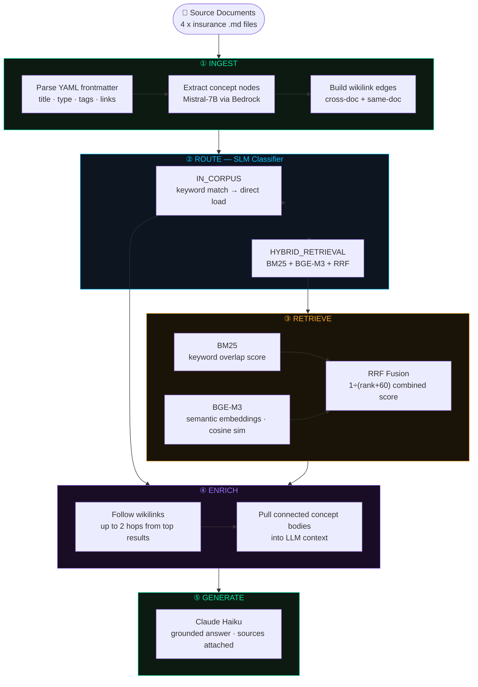

# second-brain-rag

Built this to figure out if you can give an AI agent the same kind of structured memory a human uses in Obsidian — markdown files, wikilinks, a knowledge graph — instead of just dumping everything into a vector database.

Turns out you can, and it works better for stable curated knowledge (policy docs, SOPs, underwriting rules) because the agent follows [[wikilinks]] to pull connected concepts into context automatically.

---

## How it works



---

## What it does

Four insurance documents get ingested into an in-memory knowledge graph. Each document becomes a set of typed concept nodes connected by wikilinks. When you query it, a small router model (Mistral-7B) decides whether to do a direct corpus lookup or kick off hybrid retrieval — BM25 + BGE-M3 semantic embeddings fused with RRF. Top results get enriched by following their wikilinks up to 2 hops. Then Claude generates the answer.

## Three pages

- `/` — explains the full idea: Tiago Forte → Obsidian → Karpathy → Google OKF → this
- `/pipeline` — live ingestion with the knowledge graph building in real time, plus a query interface
- `/graph` — view the current corpus graph, filter by concept type, click nodes for details

## The OKF format

Each source document is plain markdown with YAML frontmatter:

```yaml
---
title: Loss Adjustor Appointment Threshold
type: claims_procedure
source: claims_handling_sop
tags: [claims, loss-adjustor, threshold]
links:
  - [[underwriting_guidelines--property-valuation-methods]]
  - [[claims_handling_sop--total-loss-declaration]]
---
```

Same format as Obsidian internally. The agent reads what a human would read — wikilinks and all.

## Stack

- AWS Bedrock (Mistral-7B for routing, Claude Haiku for generation)
- BGE-M3 via sentence-transformers
- BM25 via rank-bm25
- RRF fusion (custom, ~15 lines)
- FastAPI + SSE for the live ingestion stream
- D3 v7 for the force-directed graph

## Run it

```bash
pip install -r requirements.txt
cp .env.example .env  # add your AWS keys
python serve.py
# http://localhost:8001
```

Hit **Ingest Source Documents** first, then query.

## The idea

Andrej Karpathy put it well: *"Obsidian is the IDE, the LLM is the programmer, the wiki is the codebase."* This is that, with an insurance underwriting corpus as the wiki.

Google formalised the same format as OKF (Open Knowledge Format) — markdown + YAML frontmatter + wikilinks + a type field. We implement the same spec from scratch, no Google tooling needed at this scale.

## License

This project is licensed under the MIT License. See the [LICENSE](LICENSE) file for details.
